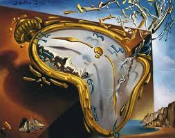

# the Dali graphics library

**Dali** is a powerful 2D/3D graphics API, based on signed distance fields, built with WebGPU.
It provides an exceptionally rich graphics model for building responsive, non-traditional
user interfaces in games, UI research, graphic design tools, visual programming languages.

Dali is a high performance graphics API that runs on modern GPUs.
Thanks to WebGPU, it is cross-platform, running either in a web browser
using WASM, or running natively on Windows, Linux, MacOS, Android and iOS.

Dali uses an extensible 2D/3D graphics model inspired by [Curv](https://github.com/curv3d/curv),
but more general, with higher performance.
* Dali begins with high quality TrueType text and SVG style scalable 2D vector graphics
  (which are resolution independent), plus resolution independent 3D primitives
  such as spheres, cylinders, etc. But there are also algebraic surfaces,
  fractals, noise based modelling primitives, etc, which can all be represented exactly.
* You can modify graphical objects using a rich set of SDF-derived operations:
  * Affine and non-affine transformations such as twist, bend, fish-eye zoom.
  * Graphics combinators such as booleans, blending, morphing, spatial repetition.
* Dali is extensible: you can define new graphics primitives and combinators procedurally,
  as operations on signed distance fields. These may be 2D or 3D or both, and are resolution
  independent. You can reproduce any of the effects seen on [ShaderToy.com](https://shadertoy.com/).
  The Dali graphics engine evaluates SDF primitives much more efficiently than ShaderToy code:
  you can have a large number of primitives on the screen without slowing down.
* Dali supports the usual graphical data structures: pixel maps, voxel grids
  and triangle meshes, plus acceleration structures for ray-casting and querying
  the signed distance to a boundary representation.
* Colour is modelled either using procedural textures (which are resolution independent)
  or using texture maps (which are discrete).

Using Dali, there are no limits to what a graphical user interface can look like.
You aren't boxed in by the SVG 2D rendering model or by what HTML/CSS can render.

Dali supports the following uses:
* game programming (eg, as an add-on to a game engine)
* graphical design tools
* innovative user interfaces and visual programming languages
* art and creative coding

Dali is coded in C++, but provides a C API so that it can be more easily integrated
into other programming languages.

Instead of a stateful, imperative interface (with a current pen position and a current transformation matrix),
where you are limited to compositing primitives onto a canvas,
Dali has a composable, pure functional interface. A shape to be rendered is represented as a tree of immutable nodes, where leaf nodes
are primitive shapes and colours, and interior nodes are graphical operations that combine and
transform shapes and colours.

See the [Wiki](https://github.com/dali3d/dali/wiki) for more details.

## Project Status
We are in the planning stages for Demo 1, which will demonstrate high performance text rendering,
combined with SDF shape operators that aren't available in widely used 2D rendering APIs.

* [Design ideas for Demo 1 (Text Rendering)](https://github.com/dali3d/dali/wiki/Text-Rendering-(Demo-1))
* [Prior art](https://github.com/dali3d/dali/wiki/Prior-Art) that I've looked at while researching text rendering.

## How To Contribute
Contact Doug Moen (doug@moens.org) for more information.
